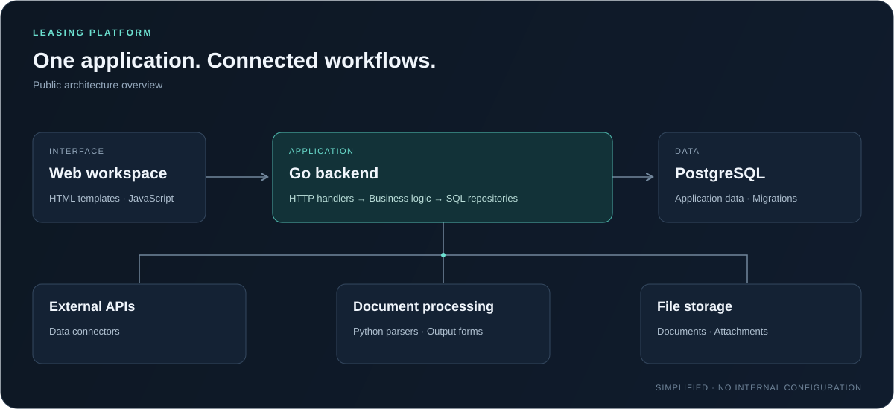

# Leasing Platform

**Работа в компании · Бэкенд и инфраструктура**

Внутренняя система компании для обработки лизинговых заявок и документов.
В рамках своей работы в компании я разрабатываю её бэкенд и отвечаю за инфраструктуру.

Здесь описаны система и моя зона ответственности. Исходный репозиторий компании закрыт; опубликована только обобщённая архитектура без кода и внутренних данных.

`Go` · `PostgreSQL` · `Python` · `Docker`

## Задача

Объединить обработку лизинговых заявок в одном веб-сервисе: собрать данные и документы, передать заявку на рассмотрение профильным сотрудникам и подготовить материалы для принятия решения.

## Архитектура

Схема обобщена для публичного обзора. Названия организации и поставщиков, внутренние адреса и эксплуатационные настройки опущены.

## Основные части

| Компонент | Назначение |
| :--- | :--- |
| Веб-интерфейс | Заявки и рабочие страницы сотрудников; HTML-шаблоны и JavaScript |
| Go-сервис | HTTP API, ролевой доступ и переходы между состояниями заявки |
| PostgreSQL | Структурированные данные и версионируемые миграции |
| Интеграции | Получение внешних данных и работа с файловым хранилищем |
| Обработка документов | Python-парсеры и подготовка выходных форм |

## Технический подход

- **Разделение ответственности:** HTTP-обработчики, бизнес-логика и SQL-запросы находятся в отдельных слоях.
- **Явный процесс:** переходы заявки описаны машиной состояний, действия сотрудников связаны с ролями.
- **Проверяемые данные:** у заполненных полей должен быть источник; решение по заявке принимает человек.

---

[← Профиль автора](https://github.com/gatoro741)
